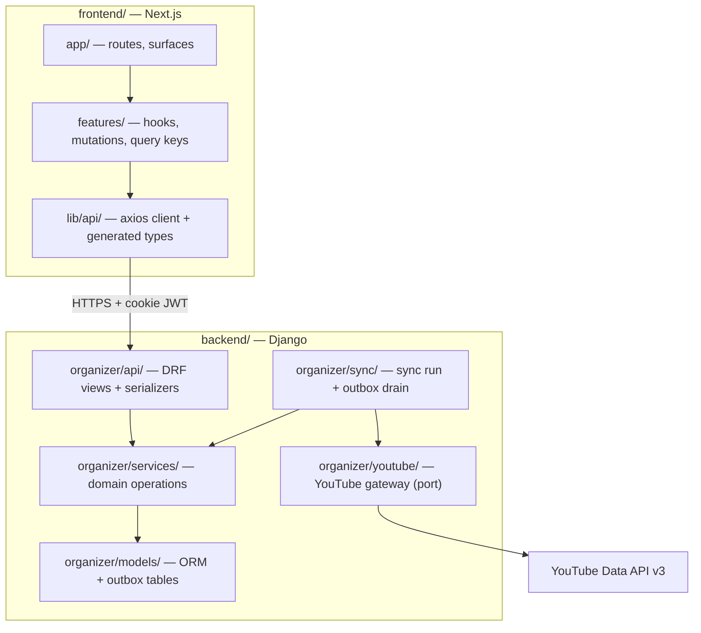
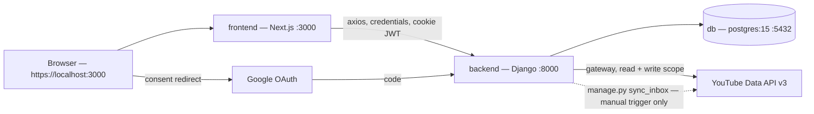
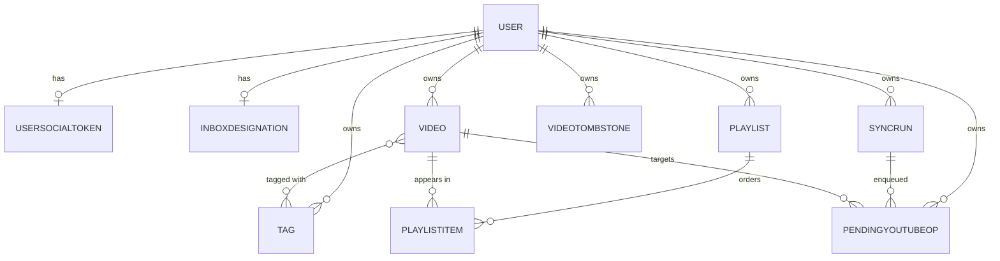
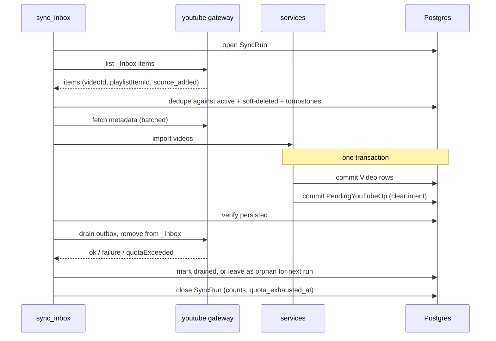

# Architecture Spine — YouTube Organizer

## Design Paradigm

**Layered services with one anti-corruption gateway, plus a transactional outbox.**

Three layers on the backend, one direction of dependency, and exactly one place that speaks
YouTube. Every outbound mutation of the source is an intent committed to the database first
and executed later — never a call made inline with the work that decided to make it.



Read the arrows as permission. Nothing points back up. `api/` never reaches past `services/`;
`services/` never imports DRF, never handles a request, and never calls YouTube; `youtube/`
never imports models or services. `sync/` is the only caller of the gateway's write methods.

| Layer | Directory | Owns | Must never |
| --- | --- | --- | --- |
| API | `organizer/api/` | HTTP, serialization, query-param parsing, pagination | Contain domain logic or call YouTube |
| Auth | `organizer/auth/` | Token issue/verify over PyJWT, the DRF cookie authentication class | Contain domain logic |
| Services | `organizer/services/` | All domain operations; the only writer of app state | Import DRF, touch `request`, or call YouTube |
| Sync | `organizer/sync/` | Sync runs, the outbox drain, quota handling | Be reachable from a request thread |
| Gateway | `organizer/youtube/` | Every YouTube Data API call, quota-error translation | Import models or services |
| Models | `organizer/models/` | Schema, constraints, managers | Contain multi-entity business rules |

## Invariants & Rules

### AD-1 — Services are the only mutation path

- **Binds:** all backend work
- **Prevents:** business rules splitting between views and the sync engine, so a video mutated
  by triage and the same video mutated by sync follow different rules
- **Rule:** every write to app state goes through a function in `organizer/services/`. DRF views
  and management commands parse input, call exactly one service function, and serialize the
  result. No `.save()`, `.create()`, `.update()` or `.delete()` outside `services/` or a
  model-layer manager it calls.

### AD-2 — Two-tree repo; no monorepo tooling

- **Binds:** repository layout, CI, the pre-push hook
- **Prevents:** a story restructuring into `apps/`/`libs/` mid-stream because a doc implied it
- **Rule:** the repo stays `frontend/` + `backend/`. No Nx, no workspace packages, no
  `apps/**`/`libs/**` paths. The frontend uses **npm** with `package-lock.json`; pnpm and its
  phantom-dependency discipline are dropped along with the workspace that motivated them. CI
  triggers and the pre-push hook are rewritten against `frontend/**`, `backend/**`,
  `package-lock.json` and `requirements.txt`, replacing `nx run-many` with the real commands
  (`tsc --noEmit`, `next build`, `jest`, `manage.py test`, `manage.py migrate`).
  `Docs/FRONTEND-STACK.md` §1 and `Docs/CI-AND-GITHUB-GATES.md` are superseded on these points
  and must be amended.

### AD-3 — DRF serializers are the one API contract; TypeScript is generated from them

- **Binds:** every endpoint, every frontend data hook
- **Prevents:** the triage epic and the browse epic hand-writing separate `Video` types that
  drift on the first nullable field — the divergence the absent shared-types package no longer
  stops
- **Rule:** DRF serializers define the wire shape. `drf-spectacular` emits the OpenAPI schema;
  `@hey-api/openapi-ts` generates the frontend types from that schema into a generated
  directory that is committed and never hand-edited. CI regenerates and fails on any diff.
  No API type is declared by hand anywhere in `frontend/`.

### AD-4 — One list endpoint owns every browse surface

- **Binds:** FR-13, FR-14, FR-18, FR-19, and every browse surface in `EXPERIENCE.md`
- **Prevents:** per-surface endpoints each reimplementing facet combination, so Tag detail and
  Search disagree on what `length ≤ 60 AND watched=no` means
- **Rule:** `GET /api/videos/` serves Uncategorized, Tag detail, Search, Filters panel,
  Needs review and Playlist detail. One documented query-param grammar; all params combine
  with AND. Adding a browse surface means adding params, never an endpoint. Responses are
  page-number paginated and always carry a total count. Infinite scroll is banned — the
  frontend renders pagination or an explicit load-more. Frontend URL params map 1:1 onto API
  params.
- **The grammar, fixed** (a grammar left "to be documented" is a grammar two epics will each
  invent):

  | Param | Form | Semantics |
  | --- | --- | --- |
  | `tag` | repeated (`?tag=guitar&tag=course`) | AND across repeats. Never comma-joined |
  | `channel` | repeated | OR within, AND against other facets |
  | `length_min`, `length_max` | integer **seconds** | inclusive bounds; never minutes |
  | `watched` | `true` \| `false` | omitted means no filter |
  | `freshness` | `evergreen` \| `perishable` \| `expired` | *(Phase 2)* |
  | `availability` | `available` \| `unavailable` | |
  | `uncategorized` | `true` | derived per AD-5 |
  | `q` | string | full-text, per AD-11 |
  | `date_field` | `imported` \| `source_added` \| `published` | selects which date the range applies to; required when a bound is given |
  | `date_from`, `date_to` | ISO-8601 date | either bound optional |
  | `playlist` | id | *(Phase 2)* |
  | `page`, `page_size` | integer | |
  | `ordering` | field name, `-` prefix for descending | |

  An omitted param is never a filter. An unknown param is a 400, not a silent ignore.

### AD-5 — Derived views are computed, never stored

- **Binds:** FR-5, FR-7, FR-13, FR-18, FR-19
- **Prevents:** a stored `is_uncategorized` flag that a bulk-tag path forgets to clear, leaving
  videos in two states at once
- **Rule:** distinguish **recorded facts** from **derived states**. Facts are stored: `watched_at`,
  `deleted_at`, `availability`, freshness fields. Derived states are computed by query at read
  time from those facts and from relationships: Uncategorized (no tags AND no playlist
  membership), Needs review (expired perishable OR unavailable), the Watched lens, Trash.
  No column caches a derived state and no code path maintains one — materialising one later
  requires a new AD.

### AD-6 — Every YouTube write goes through a transactional outbox

- **Binds:** FR-4, FR-6
- **Prevents:** a source mutation being issued inline, so a crash between the local commit and
  the remote call loses the only record that the call is still owed
- **Rule:** app state and the intent to mutate YouTube are committed in the **same database
  transaction**, as a `PendingYouTubeOp` row. A separate drain step is the only code that calls
  the gateway's write methods. A pending-clear orphan (FR-6) is just an undrained row, which is
  what the orphan banner and the Settings orphan list read. Phase-2 playlist deletion (FR-4)
  enqueues to the same outbox. No service or view ever calls a YouTube write directly.
  The drain runs **at the start of a run and again after import** — starting with it is what
  makes FR-6's "retried on the next sync" true, rather than one full cycle late.

### AD-7 — Persist and verify before mutating the source

- **Binds:** FR-5, FR-6
- **Prevents:** the destruction of the only copy of a video's metadata
- **Rule:** the order is fetch → persist locally → verify persisted → enqueue the clear. A video
  that failed to import or failed verification is never enqueued for removal. A video that was
  imported but not yet cleared is retried on the next run and is **never** skipped as a
  duplicate — dedupe suppresses re-import, not re-clear. Removal failures surface in the UI;
  silent failure is a defect.

### AD-8 — `SyncRun` is the sole record of run, quota and failure state

- **Binds:** FR-5, FR-6, FR-19; every sync-related state row in `EXPERIENCE.md § State Patterns`
- **Prevents:** the banners, Settings sync status and the command each deriving progress
  differently, and quota exhaustion being lost when the process exits
- **Rule:** every run writes one `SyncRun` (started, finished, counts, outcome,
  `quota_exhausted_at`, `acknowledged_at`). The UI reads run state only from `SyncRun`.
  Quota exhaustion is detected reactively from the API's `quotaExceeded` error, never predicted:
  stamp the run, commit everything already done, resume from the same point next run. A
  configurable per-run item cap bounds a large first import. The quota banner persists until
  `acknowledged_at` is set.

### AD-9 — Phase 1 sync is user-triggered only

- **Binds:** FR-5, FR-6
- **Prevents:** a story building a scheduler, a worker daemon or a broker against an environment
  that does not stay up
- **Rule:** `manage.py sync_inbox` is idempotent and safe to re-run. In Phase 1 it is invoked
  only by an explicit "Sync now" action and by hand. No scheduler service, no cron, no interval
  loop, no broker. **This diverges from `EXPERIENCE.md` UJ-2 and its "next scheduled run"
  promise; `EXPERIENCE.md` must be amended.** All other sync state patterns stay valid — only
  the trigger changes.

### AD-10 — Soft-delete drives Trash; dedupe checks all three states

- **Binds:** FR-5, FR-7, FR-11
- **Prevents:** a video sitting in Trash being re-imported into Uncategorized on the next sync —
  the resurrection FR-5 forbids
- **Rule:** `Video.deleted_at` drives Trash and is excluded by the default manager. Permanent
  purge hard-deletes the row and writes `VideoTombstone(youtube_id, purged_at)`. Import dedupe
  tests **active videos, soft-deleted videos, and tombstones** by YouTube video ID. Deletion is
  app-side only and never touches YouTube.

### AD-11 — Search is PostgreSQL full-text

- **Binds:** FR-14
- **Prevents:** one surface searching with `ILIKE` and another with full-text, giving the same
  query different results
- **Rule:** a maintained `tsvector` column spans title, description, channel name and tags, with
  a GIN index, queried through Django's `SearchVector`/`SearchQuery`. Search is a param on the
  `AD-4` endpoint, not a separate service. No external search engine.
- **Refresh site is part of the rule:** the vector is recomputed by an **explicit call inside the
  service** that mutated a contributing field or the tag set (AD-1) — never by a `post_save`
  signal and never by a database trigger. Signals do not fire for `bulk_create`, `update()` or
  `bulk_update`, which are exactly the paths bulk tagging uses, so a signal-based vector goes
  stale on the highest-volume operation in the product and videos stop being findable by their
  own tags.

### AD-12 — One query-key factory; optimistic mutations roll back per item

- **Binds:** all frontend data access; FR-7, FR-13, FR-14
- **Prevents:** hooks inventing incompatible cache keys, and a partial bulk failure reverting an
  entire sweep instead of the rows that actually failed
- **Rule:** a single key factory owns the hierarchy (`['videos','list',params]`,
  `['videos','detail',id]`, `['tags','list']`, …); no hook writes a key literal. Every mutation
  colocates its `onMutate` snapshot, optimistic patch, **per-item** `onError` rollback, and
  settled invalidation. Bulk tagging in Uncategorized optimistically removes rows from the
  uncategorized list cache and, on partial failure, restores **only the failed ids**. Broad
  prefix invalidation during an active selection is banned — it re-orders a triage list under
  the user's cursor. React Query is the only server-state store; no Redux, Zustand or SWR.

### AD-13 — The legacy frontend is replaced, not migrated

- **Binds:** all frontend work
- **Prevents:** a story "preserving" `PlaylistCard`/`YoutubeHeader`/`usePlaylists` and dragging
  Tailwind v4, FontAwesome, CSS Modules and raw `fetch` into new surfaces
- **Rule:** the shipped `frontend/src` prototype is not precedent. New surfaces are built to
  `Docs/FRONTEND-STACK.md` and the UX spines: Tailwind v3, shadcn/ui, `axios` + React Query,
  kebab-case filenames, `lucide-react`. Legacy files are deleted when the surface replacing them
  lands — no long-lived hybrid, no incremental in-place migration.

### AD-14 — Cookie-borne JWT is the auth mechanism; scope degradation is a first-class state

- **Binds:** FR-1, FR-2, FR-4, FR-6
- **Prevents:** a story switching to header auth (which breaks login end-to-end) or assuming
  write scope is always present
- **Rule:** auth stays JWT in an HttpOnly `access_token` cookie. `CORS_ALLOW_CREDENTIALS`, the
  single allowed origin, and `SameSite=None; Secure` are not relaxed — the cross-port OAuth flow
  depends on them. Views default to authenticated; `AllowAny` is explicit and justified.
- **Token machinery is first-party over PyJWT, not SimpleJWT.** `djangorestframework-simplejwt`
  is dropped: its last release is 5.5.1 (2025-07-21) and it does not claim Django 6.0 support,
  which is disqualifying for an auth dependency. Issuing and verifying tokens lives in one
  `organizer/auth/` module over `PyJWT`, exposed to DRF as a single custom authentication class
  that reads the cookie directly. `JWTAuthCookieMiddleware`'s header-injection trick is retired
  with SimpleJWT — the authentication class reads the cookie itself, which removes the
  middleware's global request mutation. **The cookie contract with the frontend is unchanged**;
  only the backend implementation moves.
- **Scope degradation:** the OAuth scope set gains YouTube **write** (FR-1); the granted scope is
  persisted on `UserSocialToken.token_scope` and read at runtime. When write scope is absent the
  app runs **read-only** — inbox clear (FR-6) and playlist deletion (FR-4) are disabled and
  surfaced, everything else works.

### AD-15 — Watched is contiguous coverage, not furthest position

- **Binds:** FR-16
- **Prevents:** seeking to the end marking a video watched (PRD Open Question 7)
- **Rule:** the client tracks actually-covered playback segments via the YouTube IFrame Player
  API and compares **covered duration** against the threshold, never maximum position reached.
  One `PATCH` when the threshold is genuinely crossed. Playback position is **not** persisted —
  there is no resume feature. Watched is also manually togglable, and a watched video stays in
  place.

### AD-16 — No test touches the network

- **Binds:** all test work
- **Prevents:** a test suite that fails on quota, on being offline, or on Google changing a
  response — on a backend that currently has zero tests
- **Rule:** the `organizer/youtube/` gateway has a fake implementation, injected in tests; no
  test authenticates to Google or calls the Data API. Backend tests are Django `APITestCase` and
  must exercise the cookie-borne auth path end to end (AD-14), since that is the mechanism no
  client sends a header for. Frontend tests mock every call with
  `axios-mock-adapter`. Coverage gate 70%, per `Docs/CI-AND-GITHUB-GATES.md`.

### AD-17 — Phase 1 targets localhost only

- **Binds:** all infrastructure, settings and CI work
- **Prevents:** stories half-building a production posture that nothing validates, and the
  reverse — shipping dev defaults to a real host
- **Rule:** the dev `docker-compose.yml` is the only environment in Phase 1. `DEBUG=True`, a
  hardcoded `SECRET_KEY` and empty `ALLOWED_HOSTS` are accepted **only** because nothing is
  deployed; no story may assume a production environment exists. Before any non-local
  deployment, the full production envelope (settings split, env-driven secrets, `DEBUG` off,
  `ALLOWED_HOSTS`, real TLS hostname, an updated Google redirect URI, a retargeted `deploy.yml`)
  must land as its own work. `deploy.yml` stays non-functional rather than half-adapted.

### AD-18 — Every user-owned entity carries a user foreign key

- **Binds:** the whole data model
- **Prevents:** half the schema being user-scoped and half implicitly global, which is a
  migration across every table the day the assumption changes
- **Rule:** `Video`, `Tag`, `Playlist`, `VideoTombstone`, `SyncRun`, `PendingYouTubeOp` and the
  `_Inbox` designation all carry a `user` FK, and every query filters on the requesting user —
  even though there is exactly one user and no multi-user capability is in scope in any phase.
  Uniqueness constraints are scoped per user (e.g. YouTube video ID is unique **per user**, not
  globally).

### AD-19 — Tags have one identity and one mutation semantics

- **Binds:** FR-7, FR-9, FR-13, FR-14
- **Prevents:** two things at once — (a) the triage typeahead creating `Guitar` while the Tags
  index creates `guitar`, splitting a tag across two rows, two filter results and two search
  vectors; and (b) a set-replacing `PATCH` from the watch page silently destroying tags a bulk
  apply just added
- **Rule:** a tag's identity is its **normalised name** — trimmed, internal whitespace collapsed,
  case-folded — with a case-insensitive uniqueness constraint per user (AD-18). The display form
  the user first typed is preserved for rendering; every lookup, create-or-get and comparison
  uses the normalised form. Creating a tag that normalises onto an existing one returns the
  existing tag.
- **Tag membership mutates only by explicit delta** — `add` and `remove` id/name lists. No
  endpoint accepts a whole `tags` array as a replacement set, on any resource, including the
  single-video `PATCH`. This holds for the watch-page inline editor and bulk triage alike, so
  concurrent edits compose instead of overwriting.
- Tag **merge** (FR-9, Phase 2) is the only operation that may collapse two tag rows, and it is a
  service operation that re-points memberships and refreshes affected search vectors (AD-11).

### AD-20 — The library has a backup, and irreversible upstream deletion is gated on it

- **Binds:** FR-4, FR-5, FR-6, FR-11; PRD §8 *local durability*
- **Prevents:** the product destroying the upstream copy (FR-6 clears `_Inbox`; FR-4 deletes
  whole YouTube playlists) while the only remaining copy sits unbacked in a Docker volume on one
  machine — a `docker compose down -v` or a disk failure losing the entire curated library
- **Rule:** a `make backup` target producing a timestamped `pg_dump` exists from the first
  data-model story onward, and a documented restore path is verified at least once before Phase 1
  is considered done. The Postgres volume is explicitly named and is never destroyed as part of
  any routine command, script, or documented workflow.
- **The gate:** FR-4's YouTube-side playlist deletion — the only *irreversible* upstream
  operation in the product — may only be offered when a successful backup exists within a
  defined recency window. Import and inbox-clear are not gated (they are recoverable in
  principle, and gating the weekly loop would break it), but playlist deletion is.

## Consistency Conventions

| Concern | Convention |
| --- | --- |
| Backend naming | Python `snake_case`; models singular (`Video`, `Tag`, `SyncRun`); services named for the operation (`import_inbox`, `apply_tags`, `purge_expired_trash`) |
| Frontend naming | Files `kebab-case`; components and types `PascalCase`; vars/functions `camelCase`; constants `SCREAMING_SNAKE_CASE`. Props typed as `type {ComponentName}Props`, `const` arrow typed `React.FC<Props>`, `export default` at the bottom |
| Wire format | `snake_case` on the wire, end to end. No camelCase transformation layer — types are generated, so there is nothing to gain and a mapping to drift |
| Identifiers | Internal PKs are database ids; YouTube video and playlist ids are strings and are the natural dedupe key (AD-10) |
| Dates & times | ISO 8601, UTC, timezone-aware. The three video dates stay distinct and are never conflated: `imported_at`, `source_added_at`, `published_at` |
| Durations | Stored as integer seconds; the YouTube ISO-8601 duration is parsed at the gateway and never stored raw |
| Thumbnails | The `maxres → high → medium → default` fallback is applied once, at the gateway, and the resolved URL is stored. New remote hosts require a `next.config.ts` `remotePatterns` entry |
| Error shape | One envelope for every non-2xx: `{ "detail": str, "code": str, "errors": {field: [str]} \| null }`. Enforced by a single custom DRF `EXCEPTION_HANDLER` — DRF's default shapes differ per exception type and must not leak through. Per-item bulk outcomes return a result list so the frontend can roll back per item (AD-12) |
| Bulk operations | Namespaced under the resource being mutated, action-suffixed — `POST /api/videos/bulk-tag/`, `POST /api/videos/bulk-delete/`, `POST /api/videos/bulk-freshness/`. Accepts an id list, returns a per-id outcome. Partial success is a normal result, not an error |
| Client-observed state | State the browser discovers (a video the embed cannot play, FR-19) is reported to a dedicated service endpoint, never written through a generic resource `PATCH`. Services remain the only writer (AD-1) |
| Mutation surface | Services only (AD-1). Sync-side writes to YouTube: outbox only (AD-6) |
| Logging | Structured, one line per sync decision (imported / skipped-duplicate / skipped-tombstoned / enqueued-clear / clear-failed) with the YouTube id. This log is the debugging surface for FR-6 |
| Config & secrets | Everything environment-driven; `GOOGLE_*` and `POSTGRES_*` from env, never committed. No new hardcoded settings values |
| Auth | Cookie JWT (AD-14). Views authenticated by default; `AllowAny` explicit |
| Migrations | One migration per PR where possible; `makemigrations` then `make backend-migrate` inside the container |
| Commits & branches | Conventional Commits; `feat/story-*` → PR → `develop` (squash) → `main` (merge + `vX.Y.Z`). Never commit directly to `main`/`develop`. **No AI/bot attribution on any artifact** |

## Stack

Verified against the web on 2026-07-24 unless marked otherwise. Frontend pins are inherited
from `Docs/FRONTEND-STACK.md`, which is authoritative on the frontend stack.

| Name | Version |
| --- | --- |
| Python | 3.13 |
| Package managers | `npm` (frontend), `pip` + `requirements.txt` (backend). **Not** pnpm — see AD-2 |
| Django | 6.0.7 (upgrade from 5.2) |
| Django REST Framework | `>=3.17.0` — Django 6.0 support landed in 3.17.0 (March 2026) |
| PyJWT | `2.13.0` — replaces djangorestframework-simplejwt (AD-14); framework-agnostic, so no Django coupling |
| drf-spectacular | 0.30.0 |
| google-api-python-client / google-auth / google-auth-oauthlib | bounded pins, set at implementation |
| PostgreSQL | 15 |
| Next.js | `~16.1.6` (inherited; see Deferred) |
| React / React DOM | `^19` |
| TypeScript | strict, no `any` |
| Tailwind CSS | `^3.4.19` (v3, **not** v4) |
| shadcn/ui + Radix | generated components, never hand-edited |
| @tanstack/react-query | `5.100.14` |
| axios | `^1.16.1` |
| react-hook-form / zod / @hookform/resolvers | `7.76.1` / `4.4.3` / `^5.4.0` |
| @hey-api/openapi-ts | `0.99.0` — pre-1.0, so pin exactly; `^` does not protect a `0.x` major |
| lucide-react / date-fns / react-day-picker | `^1.17.0` / `^4.4.0` / `^10.0.1` |
| Jest / React Testing Library | `^29.7.0` / `^16` |
| Geist Sans | via `next/font`, self-hosted at build |

## Structural Seed

### Phase 1 runtime (localhost only — AD-17)



No scheduler, worker, broker or cache service exists. HTTPS with self-signed certs on both
ports; the cross-port OAuth flow depends on it.

### Core entities



`Video` carries the locally-stored metadata (title, description, channel, thumbnail, duration
seconds, the three dates), `deleted_at`, `watched_at`, `availability`, and Phase-2 freshness
fields. `INBOXDESIGNATION` persists the FR-2 `_Inbox` choice in the database — never an
environment variable. `PLAYLIST`, `PLAYLISTITEM` and the freshness fields are Phase 2; the
`Video` schema anticipates them so Phase 2 is additive.

### The import invariant (AD-6, AD-7)



### Source tree

```text
backend/organizer/
  api/          # DRF views, serializers, query-param parsing, pagination
  auth/         # PyJWT issue/verify + the DRF cookie authentication class (AD-14)
  services/     # domain operations — the only writer of app state
  sync/         # sync_inbox run, outbox drain, quota handling
  youtube/      # the gateway (port) + its fake for tests
  models/       # ORM, managers, constraints
  management/commands/sync_inbox.py
  tests/

frontend/src/
  app/          # App Router routes — the surfaces in EXPERIENCE.md § IA
  components/
    ui/         # shadcn-generated — never hand-edited
  features/     # per-domain hooks, mutations, components (videos, tags, triage, sync)
  lib/
    api/        # axios client + generated types (committed, never hand-edited)
    query-keys.ts   # the single key factory (AD-12)
```

## Capability → Architecture Map

| Capability / Area | Lives in | Governed by |
| --- | --- | --- |
| FR-1 auth + write scope | `google_auth_views.py`, `organizer/auth/`, `UserSocialToken` | AD-14 |
| Library durability | `make backup`, named volume, FR-4 gate | AD-20 |
| FR-2 `_Inbox` designation | `InboxDesignation`, `api/`, `services/` | AD-1, AD-18 |
| FR-3, FR-4 migration *(P2)* | `sync/`, outbox | AD-6, AD-7, AD-9 |
| FR-5 inbox import | `sync/`, `youtube/`, `services/` | AD-7, AD-10, AD-18 |
| FR-6 crash-safe clear | outbox drain, `PendingYouTubeOp`, `SyncRun` | AD-6, AD-7, AD-8 |
| FR-7 bulk categorization | bulk endpoints, `features/triage` | AD-1, AD-12, conventions (bulk) |
| FR-8 suggestions *(P2)* | `services/` | AD-1 |
| FR-9 tags | `Tag`, `services/` | AD-1, AD-18 |
| FR-10 playlists *(P2)* | `Playlist`, `PlaylistItem` | AD-1, AD-18 |
| FR-11 delete + trash | `Video.deleted_at`, `VideoTombstone`, purge | AD-10 |
| FR-12 channel + length facets | gateway parsing, `Video` | AD-4, conventions (durations, thumbnails) |
| FR-13 facet browse | `GET /api/videos/` | AD-4, AD-5 |
| FR-14 search | `tsvector` + the same endpoint | AD-4, AD-11 |
| FR-15 embedded playback | `features/watch`, IFrame Player API | AD-15 |
| FR-16 auto-watched | client coverage tracker + `PATCH` | AD-15, AD-5 |
| FR-17, FR-18 freshness *(P2)* | `Video` freshness fields, Needs review | AD-4, AD-5 |
| FR-19 unavailability | gateway detection during sync and at play | AD-4, AD-5, AD-8 |
| All browse surfaces | `frontend/src/features/*` | AD-3, AD-12, AD-13 |

## Deferred

- **The production envelope in full** (AD-17) — deployment target, settings split, secret
  management, `ALLOWED_HOSTS`, TLS hostname, a retargeted `deploy.yml`, and a
  `docker-compose.prod.yml` that does not yet exist. Deferred because Phase 1 answers whether
  Alexis uses the tool at all; deploying first would be building for an unproven habit.
  **Revisit the moment anything is exposed beyond localhost** — the current dev defaults are
  unsafe on a real host.
- **Scheduled/unattended sync** (AD-9) — needs an always-on host, which needs the production
  envelope. Revisit together with it.
- **The whole inherited frontend pin block** — `Docs/FRONTEND-STACK.md` is explicitly "mirrored
  from Accountr": it records another project's shipped versions at a past date, and the spine
  inherits the entire table on the doc's authority rather than on any pin being verified current.
  The one pin that *was* checked is already behind — `~16.1.6` against a 16.2.x LTS line and a
  July 2026 Next.js security release — so treat the rest as suspect too. Deferred rather than
  overridden because the doc is authoritative; **re-verify the block before the first frontend
  PR**, and amend the doc rather than the code where a pin moves.
- **Trash retention window length** — a product setting, not an architectural invariant. Any
  value works against AD-10.
- **Watched threshold value** — configurable in Settings per `EXPERIENCE.md`; AD-15 fixes the
  *measurement*, not the number.
- **Suggestion mechanism** (FR-8, PRD Open Question 2) — no architecture is committed until the
  triage pressure valve is actually needed.
- **Availability-check cadence** (FR-19) — opportunistic at play time and during sync per the
  PRD; the exact schedule waits on real quota measurements (PRD Open Question 3).
- **Archive-watched sweep** (PRD Open Question 1) — no data model committed; AD-5 keeps Watched
  derived so a later lens costs nothing.
