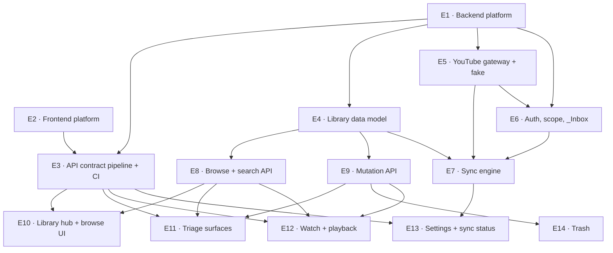

# Work Split — Phase 1

How the PRD's Phase-1 scope splits into buildable epics against the spine. This is a **bridge
into `bmad-create-epics-and-stories`**, not a sprint plan: it fixes boundaries and dependency
order, and leaves story decomposition to that skill.

Each epic names the ADs that govern it. An epic whose ADs aren't yet satisfied by its
dependencies isn't ready to start.

## The shape of the problem

Three facts drive the entire split:

1. **The backend is an auth stub and the frontend is disowned legacy.** Almost nothing exists.
   The foundation epics are not overhead — they are most of the risk.
2. **AD-3 makes the API contract a build-time artifact.** The codegen pipeline must exist before
   any frontend surface can consume a typed endpoint, which puts it early and on the critical path.
3. **The sync engine (AD-6, AD-7, AD-8) is the only genuinely hard component.** Everything else
   is CRUD with good discipline. It deserves to be built alone, against the fake gateway, before
   any UI depends on it.

## Dependency graph

## Foundation

### E1 · Backend platform

Django 6.0.x bump; **replace SimpleJWT with the first-party PyJWT auth module** and retire
`JWTAuthCookieMiddleware`'s header injection; bounded pins across `requirements.txt`; the layered
package skeleton (`api/`, `auth/`, `services/`, `sync/`, `youtube/`, `models/`); `APITestCase`
harness; the `make backup` target and named volume.

- **Governed by:** AD-1, AD-14, AD-16, AD-17, AD-20
- **Depends on:** nothing — **start here**
- **Risk:** highest in the phase. It rewrites the one thing that currently works. The auth
  replacement wants tests before the swap, not after.

### E2 · Frontend platform

Rebuild `frontend/src` to `Docs/FRONTEND-STACK.md`: Tailwind v4 → v3, shadcn/ui init, React Query
provider, axios client with credentials, `next/font` Geist, the query-key factory, kebab-case
structure, Jest + RTL harness. **Delete the legacy prototype** rather than migrating it.

- **Governed by:** AD-2, AD-12, AD-13
- **Depends on:** nothing — **runs fully parallel to E1**
- **Note:** re-verify the inherited pin block first (see the spine's Deferred) — the Next.js pin
  is already behind its LTS line.

### E3 · API contract pipeline + CI

`drf-spectacular` schema generation; `@hey-api/openapi-ts` into `frontend/src/lib/api/`; the CI
drift gate that regenerates and fails on diff; the custom DRF `EXCEPTION_HANDLER`; rewriting
`ci.yml`, `deploy.yml` and the `pre-push` hook off Nx/pnpm/Prisma onto this repo's real commands.

- **Governed by:** AD-2, AD-3, error-shape convention
- **Depends on:** E1, E2
- **Why early:** every frontend epic consumes generated types. Late here blocks four epics.

## Domain core

### E4 · Library data model

`Video`, `Tag`, the tag through-table, `VideoTombstone`, the `Playlist` skeleton; user FKs and
per-user uniqueness; `deleted_at` and the default manager; tag normalisation and the
case-insensitive constraint; the `tsvector` column, GIN index, and the service-side refresh.

- **Governed by:** AD-5, AD-10, AD-11, AD-18, AD-19
- **Depends on:** E1
- **Note:** AD-19's normalisation and AD-10's three-way dedupe belong here, as constraints — not
  later as validation in a view.

### E5 · YouTube gateway + fake

The `organizer/youtube/` port: playlist and playlist-item reads, batched metadata fetch, item
removal, quota-error translation, availability detection, ISO-8601 duration parsing, the
`maxres → high → medium → default` thumbnail fallback. Plus the fake used by every test.

- **Governed by:** AD-1, AD-16, gateway conventions
- **Depends on:** E1
- **Note:** the fake is a deliverable, not test scaffolding. E7 cannot be built honestly without it.

### E6 · Auth, write scope, `_Inbox` designation

OAuth scope set extended to YouTube write; granted scope persisted and read at runtime; the
read-only degraded mode; `InboxDesignation` persisted in the database; playlist listing and
selection; create-an-`_Inbox` fallback. FR-1, FR-2.

- **Governed by:** AD-14, AD-18
- **Depends on:** E1, E5

## The hard part

### E7 · Sync engine

`manage.py sync_inbox`: `SyncRun` lifecycle; three-way dedupe; fetch → persist → verify →
enqueue ordering; `PendingYouTubeOp` written in the import transaction; the drain at run start
and after import; orphan retry; reactive quota detection with the per-run cap; the structured
per-decision log. FR-5, FR-6.

- **Governed by:** AD-6, AD-7, AD-8, AD-9, AD-10, AD-16
- **Depends on:** E4, E5, E6
- **Risk:** the crash-safety invariant is the product's only irreversible mechanism. Test the
  failure paths — crash between persist and clear, clear fails, quota mid-run — as first-class
  cases, not edge cases.

## API surface

### E8 · Browse + search API

`GET /api/videos/` with the full AD-4 grammar; page-number pagination with total counts; derived
`uncategorized`; full-text search; channel and length facets; the Library hub's per-dimension
counts. FR-12, FR-13 (non-date), FR-14.

- **Governed by:** AD-4, AD-5, AD-11
- **Depends on:** E4

### E9 · Mutation API

Tag CRUD; delta-only tag application, single and bulk; freshness bulk endpoint (schema only in
Phase 1); soft-delete, restore and purge; the per-id bulk outcome shape. FR-7, FR-9, FR-11.

- **Governed by:** AD-1, AD-10, AD-19, bulk conventions
- **Depends on:** E4

## Frontend surfaces

### E10 · Library hub + browse surfaces

The shelf-row hub (never a video list), Tag detail, Tags index, the Filters panel, search,
URL-backed filter state, pagination/load-more. FR-13, FR-14.

- **Governed by:** AD-4, AD-12, AD-13; `EXPERIENCE.md § Information Architecture`
- **Depends on:** E3, E8

### E11 · Triage surfaces

Uncategorized in List and Focus modes; selection (checkbox, shift-range, `x`, long-press); the
bulk action bar; optimistic apply with per-row revert; keyboard shortcuts with the WCAG 2.1.4
disable/remap/scoping trio. FR-7.

- **Governed by:** AD-12, AD-19; PRD §8 triage bound; `EXPERIENCE.md § Triage Modes`
- **Depends on:** E3, E8, E9
- **Risk:** the ≤2-interaction bound is load-bearing for SM-C2. If it slips here, the PRD's own
  fallback is to pull FR-8 suggestions forward from Phase 2.

### E12 · Watch + playback

Single-column watch page with no rail; IFrame Player API embed; the contiguous-coverage watched
tracker; inline tag editing (delta semantics); open-in-YouTube; the unavailable-video state.
FR-15, FR-16.

- **Governed by:** AD-15, AD-19, client-observed-state convention
- **Depends on:** E3, E8, E9

### E13 · Settings + sync status

Google connection and re-consent; `_Inbox` designation UI; **"Sync now"** (the only Phase-1
trigger); sync status read from `SyncRun`; orphan, partial-failure, quota and read-only-scope
banners; theme; watched threshold.

- **Governed by:** AD-8, AD-9, AD-14; `EXPERIENCE.md § State Patterns`
- **Depends on:** E3, E7

### E14 · Trash

Recently-deleted surface, restore, retention purge with tombstone creation. FR-11.

- **Governed by:** AD-10, AD-20
- **Depends on:** E3, E9

## Critical path

`E1 → E5 → E6 → E7 → E13`

The sync engine gates the product's core loop and sits behind three foundation epics. E2 runs
free of it entirely, so frontend platform work should start on day one in parallel rather than
queueing behind the backend.

**Cheapest useful slice:** E1 + E5 + E6 + E7 with no UI at all. That proves the crash-safe import
against the real API from the command line — the highest-risk mechanism in the product,
validated before a single surface is built on top of it.

## Phase 2

Deliberately not decomposed — it is earned only once Phase 1 proves the habit sticks.

| Area | FRs | Notes |
| --- | --- | --- |
| Migration | FR-3, FR-4 | Reuses the E7 outbox. **FR-4 deletion is gated on AD-20's backup** |
| Playlists | FR-10 | Schema anticipated in E4; ordering and reorder are the new work |
| Freshness + Needs review | FR-17, FR-18 | Adds `freshness` params to the E8 grammar |
| Unavailable detection | FR-19 | Gateway detection exists from E5; the surface and sweep are new |
| Date-range filters | FR-13 (dates) | Params already reserved in the AD-4 grammar |
| Tag merge | FR-9 | AD-19 already assigns it to a service operation |
| Suggestions | FR-8 | **Pull forward immediately if E11's triage bound slips** |
| Production envelope | — | The whole deferred dimension: settings split, secrets, TLS, deploy, and scheduled sync (AD-9, AD-17) |
